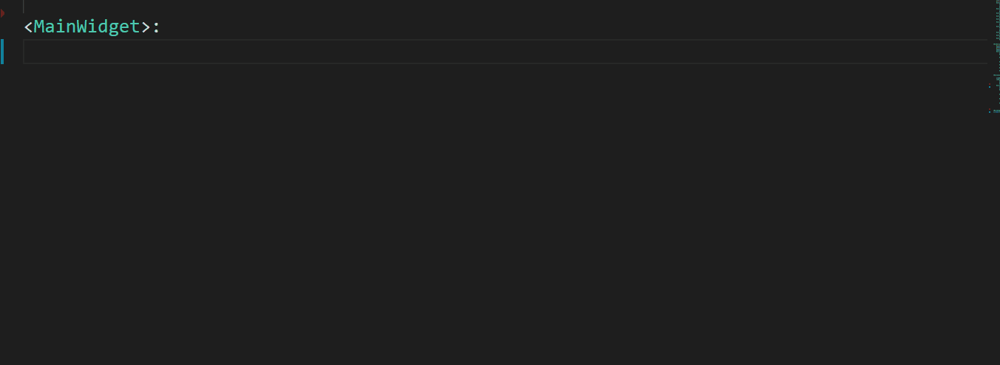

<p align="center"><a href="#" ></a>
<br>
  Kivy Snippet support VS Code
  <br>
  Dev. Porton
</p>

[](https://marketplace.visualstudio.com/items?itemName=watchakorn-18k.kivy-snippets) [](https://marketplace.visualstudio.com/items?itemName=watchakorn-18k.kivy-snippets) [](https://marketplace.visualstudio.com/items?itemName=watchakorn-18k.kivy-snippets) [](#)

<p align="center" ><a href="#" ><kbd> </kbd></a></p> 


## เริ่มแบบด่วน
- ติดตั้งส่วนขยาย 
- ติดตั้ง Python

## หลังจากติดตั้งแล้วให้เพิ่มคำสั่งต่อนี้ไป
- กด Ctrl + Shift + P 
- กรอกคำว่า preferences:Open Settings (JSON) ลงไป
- กด Enter
- คัดลอกคำสั่งด้านล่างไปใส่แล้ว เปิดปิดโปรแกรมใหม่
```json
    },

    "editor.snippetSuggestions":"top",
    "editor.tabCompletion":true
       
}
```

## Quick Start
- install extension
- install Python

## After installing add the following commands
- Hold Ctrl + Shift + P 
- Type the word ' preferences:Open Settings (JSON) '
- Press Enter
- Copy and paste the command below, then reopen and close the program.
```json
    },

    "editor.snippetSuggestions":"top",
    "editor.tabCompletion":true
       
}
```

# Change Log


## [1.0.3]
- Updated Snippet Kivy Added 
    - size_hint
    - padding
    - spacing
    - color
    - pos
    - size
    - text
    - More...

## [1.0.2]
- Displayname fixed

## [1.0.1]

- Sample image attached

## [1.0.0]

- Initial release of kivy-snippets extension